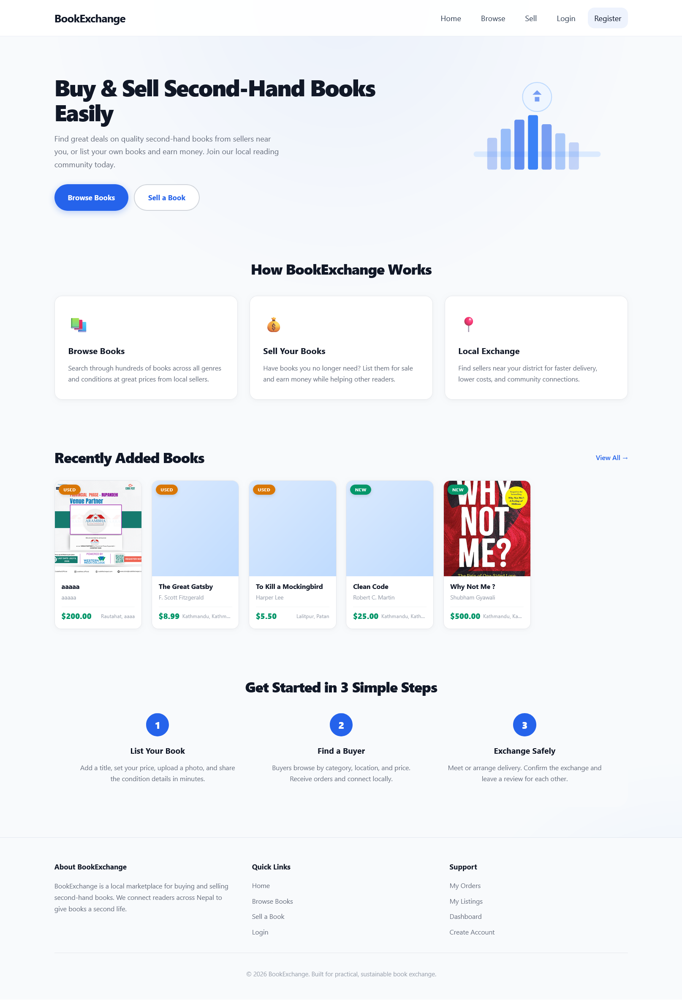
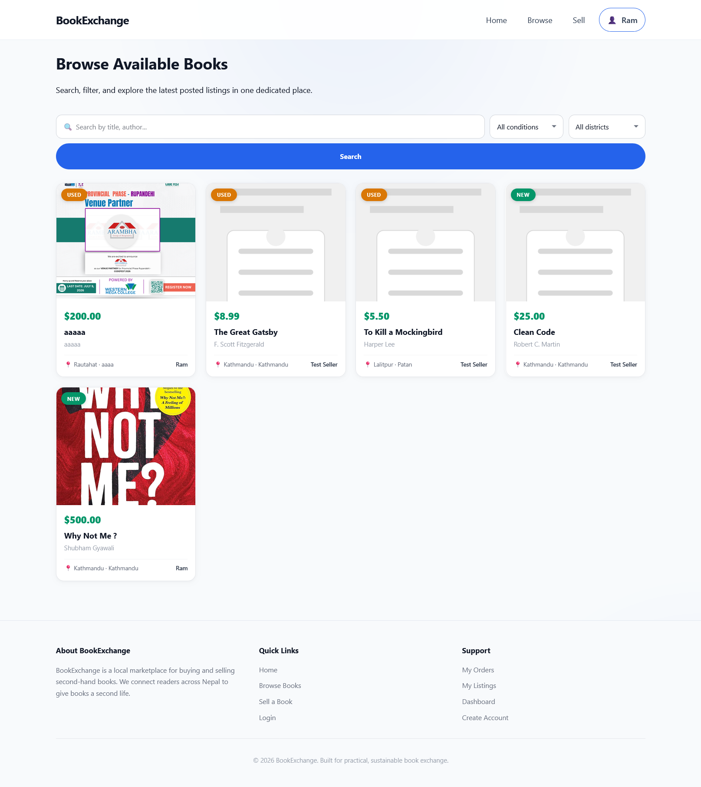
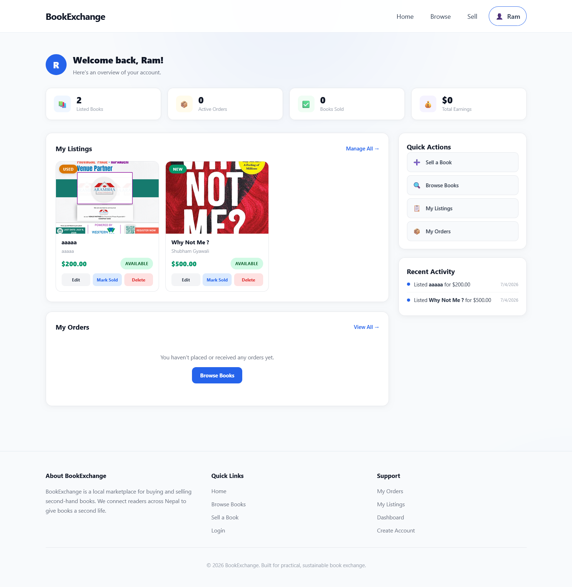
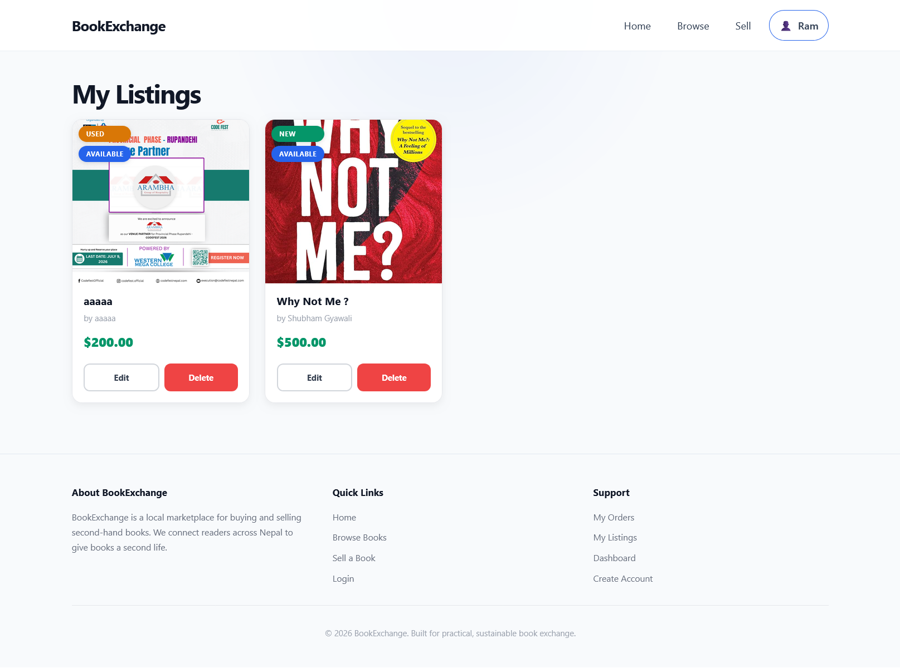
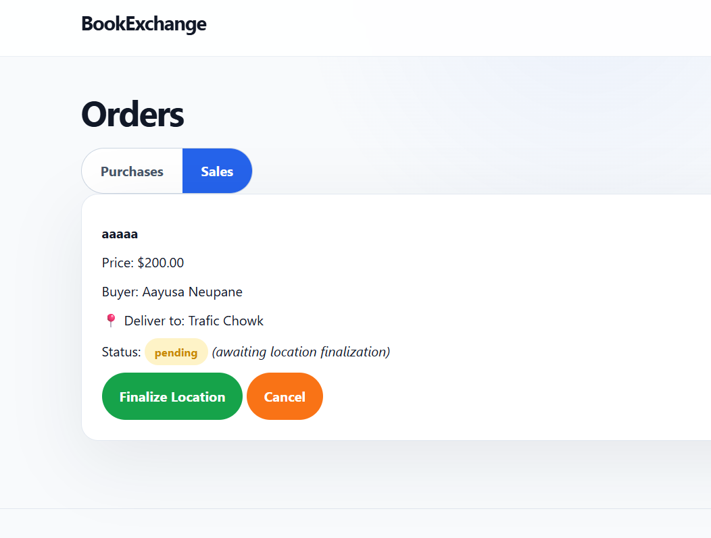
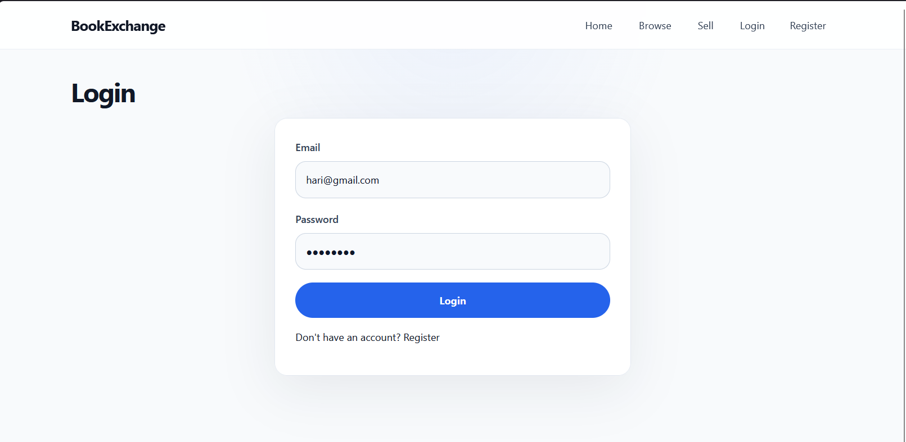
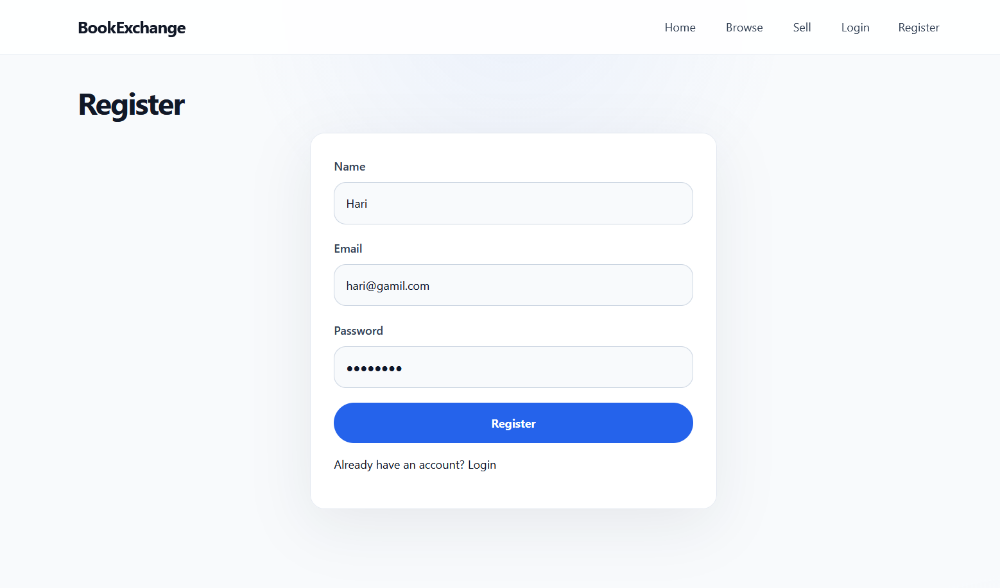

# BookExchange

## Overview

BookExchange is a PHP/MySQL marketplace for buying and selling second-hand books. It connects readers across Nepal, making it easy to list books, browse by location and condition, and manage orders — all with a modern, responsive UI.

## What it solves

- **No dedicated book marketplace** for Nepali readers — BookExchange fills that gap with district-based local listings across all 77 districts of Nepal.
- **Cumbersome selling workflows** — simplified listing form with price suggestions, drag-and-drop image upload, and savings calculator.
- **Hard to find local books** — filter by district (grouped by 7 provinces) and condition (New/Used).
- **No visibility into orders** — unified dashboard showing stats, listings, orders, earnings, and recent activity.
- **Zero cost for students** — built for XAMPP, no paid dependencies, fully custom frontend and backend.

---

## Features in Detail

### 1. User Authentication
- **Registration** — name, email, phone, password with validation
- **Login/Logout** — session-based auth, protected routes via `auth_check.php`
- **User menu** — dropdown in header with links to Dashboard, My Listings, Orders, Purchase History, Logout

### 2. Browse Books (`/pages/browse.php`)
- **Search** — real-time search by title or author
- **Filters** — condition dropdown (New/Used), district dropdown (77 districts grouped by 7 provinces)
- **Results grid** — responsive auto-fill cards with:
  - Cover image with zoom hover effect
  - Condition badge (green for New, amber for Used)
  - Price, title, author
  - Location + seller name in card footer
- **Skeleton loaders** — shimmer animation while books load
- **URL params** — filter state persisted in query string on page load

### 3. Sell a Book (`/pages/sell-book.php`)
- **Book Information** — title (required), author, description with 2000-character counter
- **Book Condition** — chip-style radio buttons (New / Used), condition notes text field
- **Pricing** — selling price with `$` prefix, original price, auto-calculated savings display
- **Price Suggestion** — on condition select, fetches `suggest_price.php` API and shows average market price range
- **Location** — district dropdown (all 77 Nepal districts) + specific location text field
- **Cover Image** — drag-and-drop upload zone with preview thumbnail and remove button
- **Form validation** — inline, required field indicators, loading state on submit
- **Gradient submit button** — full-width, hover lift effect, loading spinner

### 4. Dashboard (`/pages/dashboard.php`)
- **Welcome header** — user avatar (first initial), greeting, subtitle
- **4 Stat Cards** — computed live from API data:
  - 📚 Listed Books — total count of user's listings
  - 📦 Active Orders — pending/confirmed/shipped orders count
  - ✅ Books Sold — completed sales count
  - 💰 Total Earnings — sum of completed sale prices
- **My Listings section** — responsive card grid (up to 6) with:
  - Cover image (180px fixed height, object-fit cover)
  - Condition badge overlay
  - Title, author, price, status badge
  - Action buttons: Edit (inline modal), Mark Sold (status change), Delete (confirmation)
- **My Orders section** — order rows with:
  - Book title, buyer/seller name, date, status badge, role tag (Sale/Purchase)
  - Empty state with "Browse Books" CTA
- **Quick Actions panel** — buttons linking to Sell, Browse, My Listings, Orders
- **Recent Activity** — synthesized timeline from listings and orders, with colored dots (blue = listing, green = order), sorted by date

### 5. My Listings (`/pages/my-listings.php`)
- **Card grid** — same design as browse cards with:
  - Image overlay badges (condition + status)
  - Zoom hover effect
  - Price, title, author
  - Edit / Delete buttons
- **Edit Modal** — inline popup form with:
  - Title, author, description, condition, price, district, location
  - Optional image replacement
  - Save / Cancel buttons
- **Delete** — confirmation dialog, calls `delete_book.php` API

### 6. Book Details (`/pages/book-details.php`)
- Large cover image, title, author, description
- Price with original price strikethrough + savings percentage
- Condition badge, condition notes
- Location (district + specific location)
- Seller name, email, phone
- Place Order button (triggers `place_order.php`)

### 7. Orders (`/pages/orders.php`)
- **Tabs** — filter by status: All, Pending, Confirmed, Shipped, Completed, Cancelled
- **Split views** — toggle between "As Buyer" and "As Seller"
- **Order cards** — book info, partner name, price, delivery location, status badge
- **Status updates** — sellers can advance order status (pending → confirmed → shipped → completed)
- **Delivery location** — buyers can finalize location after confirmation
- **Reviews** — buyers can leave a review after completion

### 8. Purchase History (`/pages/purchase-history.php`)
- Completed purchases with seller info, price comparison (paid vs original), purchase date

### 9. Homepage (`/pages/index.php`)
- **Hero** — two-column layout: heading (48px), description, CTA buttons (Browse Books / Sell a Book) + custom SVG book illustration
- **Features** — 3 cards (Browse, Sell, Local Exchange) with hover lift effect
- **Recently Added Books** — fetched from API, up to 6 books with image, title, price, condition badge, location. Shimmer skeleton while loading
- **How It Works** — 3-step horizontal section (List → Find a Buyer → Exchange Safely) with numbered blue circles

### 10. Responsive Design
- Desktop (1200px+): full multi-column layouts
- Tablet (900px): stacked hero, 2-column stats, single sidebar
- Mobile (720px): single column, compact cards, collapsible nav

---

## How It Works — User Flow

### For Buyers
```
1. Visit Homepage → Browse Featured Books
2. Search by title/author or filter by district/condition
3. Click a book card → View full details (price, images, seller info, location)
4. Click "Place Order" → Order created with "pending" status
5. Wait for seller to confirm
6. After seller confirms → Finalize delivery location
7. Seller ships → Status becomes "shipped"
8. Receive book → Confirm receipt → Status becomes "completed"
9. Leave a review for the seller
```

### For Sellers
```
1. Register/Login → Navigate to "Sell a Book"
2. Fill form (title, author, description, condition, price, location, image)
3. Submit → Book listed with "available" status
4. View listing in Dashboard or My Listings
5. Receive order notification → Confirm or manage in Orders page
6. Update status: pending → confirmed → shipped → completed
7. Track earnings in Dashboard stat cards
8. Edit listing details anytime, or mark as sold manually
9. Delete listing if no longer available (no active orders)
```

---

## Data Flow

```
┌─────────────┐     HTTP Request      ┌──────────────┐     PDO Query     ┌─────────┐
│   Browser   │ ──────────────────►   │   PHP API    │ ───────────────► │  MySQL  │
│  (JS fetch) │ ◄──────────────────   │  (api/*.php) │ ◄─────────────── │ (XAMPP) │
└─────────────┘     JSON Response     └──────────────┘                  └─────────┘
       │                                      │
       │                                      │
       ▼                                      ▼
  Renders HTML                          Validates Input
  via innerHTML                          Checks Auth Token
  or page load                           Processes Data
                                         Returns JSON
```

### Page Load Flow
```
Browser loads page (e.g., browse.php)
  → PHP renders initial HTML shell (header, container, footer)
  → CSS loads (style.css)
  → JavaScript loads (api.js, auth.js, pages-specific JS)
  → JS fires fetch() to API endpoint
  → API queries MySQL via PDO
  → API returns JSON
  → JS renders data into DOM (cards, tables, stats)
  → User sees complete UI
```

### Book Listing Flow
```
Seller fills sell form
  → JavaScript collects FormData (text fields + image file)
  → POST to api/add_book.php
  → PHP validates session, sanitizes inputs
  → Moves uploaded image to /uploads/
  → INSERT INTO books table
  → Returns JSON { success: true, book_id: X }
  → JS shows success message, resets form
  → Book now visible on Browse page and seller's Dashboard
```

### Order Flow
```
Buyer clicks "Place Order" on book-details.php
  → POST to api/place_order.php
  → PHP checks book availability, creates order
  → INSERT INTO orders (buyer_id, seller_id, book_id, price, status='pending')
  → Updates book status to 'pending'
  → Seller sees order in Dashboard and Orders page
  → Seller updates status via api/update_order_status.php
  → Status progresses: pending → confirmed → shipped → completed
  → Each update: UPDATE orders SET status = ? WHERE id = ?
```

### Search & Filter Flow
```
User types search or selects filter on browse page
  → JavaScript reads form values (search, condition, district)
  → Builds query string: ?search=xyz&condition=new&district=Kathmandu
  → fetch() to api/get_books.php with query string
  → PHP builds SQL with WHERE clauses + LIKE for search
  → Returns filtered books as JSON array
  → JS clears current grid, re-renders with new data
  → URL updated via history.replaceState for bookmarkable filters
```

### Price Suggestion Flow
```
Seller selects condition (New/Used) on sell form
  → JS fires GET to api/suggest_price.php?condition=new
  → PHP calculates average price of available books with same condition
  → Returns { suggested: 15.50, count: 12, range_min: 5.00, range_max: 30.00 }
  → JS displays suggestion box below condition chips
```

### Dashboard Stats Flow
```
Dashboard loads
  → Three parallel fetch() calls:
      1. api/get_books.php?seller_id=X  → user's listings
      2. api/get_orders.php?role=buyer  → user's purchase orders
      3. api/get_orders.php?role=seller → user's sale orders
  → JS computes:
      - stat-listings: listings.length
      - stat-orders: orders.filter(pending/confirmed/shipped).length
      - stat-sold: sellerOrders.filter(completed).length
      - stat-earnings: sellerOrders.filter(completed).reduce(price sum)
  → Updates DOM textContent of each stat number
  → Also renders listings grid, order rows, and activity timeline
```

---

## Database Schema

### Table: `users`
| Column | Type | Purpose |
|--------|------|---------|
| id | INT (PK, AUTO_INCREMENT) | User ID |
| name | VARCHAR(100) | Full name |
| email | VARCHAR(255) UNIQUE | Login email |
| phone | VARCHAR(20) | Contact number |
| password | VARCHAR(255) | Hashed password |
| created_at | TIMESTAMP | Registration date |

### Table: `categories`
| Column | Type | Purpose |
|--------|------|---------|
| id | INT (PK, AUTO_INCREMENT) | Category ID |
| name | VARCHAR(100) | Category name |

### Table: `books`
| Column | Type | Purpose |
|--------|------|---------|
| id | INT (PK, AUTO_INCREMENT) | Book ID |
| seller_id | INT (FK → users.id) | Listing owner |
| category_id | INT (FK → categories.id) | Book category (nullable) |
| title | VARCHAR(200) | Book title |
| author | VARCHAR(100) | Author name |
| description | TEXT | Book description |
| condition_type | ENUM('new','used') | New or Used |
| condition_notes | VARCHAR(255) | Additional notes |
| price | DECIMAL(10,2) | Selling price |
| original_price | DECIMAL(10,2) | Original price (nullable) |
| district | VARCHAR(100) | Nepal district |
| location | VARCHAR(255) | Specific location |
| image_url | VARCHAR(500) | Cover image path |
| status | ENUM('available','pending','sold') | Listing status |
| created_at | TIMESTAMP | Listing date |

### Table: `orders`
| Column | Type | Purpose |
|--------|------|---------|
| id | INT (PK, AUTO_INCREMENT) | Order ID |
| book_id | INT (FK → books.id) | Ordered book |
| buyer_id | INT (FK → users.id) | Buyer |
| seller_id | INT (FK → users.id) | Seller |
| price | DECIMAL(10,2) | Purchase price |
| status | ENUM('pending','confirmed','shipped','completed','cancelled') | Order status |
| delivery_location | VARCHAR(255) | Buyer's delivery address |
| location_finalized | TINYINT(1) | Whether location is set |
| created_at | TIMESTAMP | Order date |

### Table: `reviews`
| Column | Type | Purpose |
|--------|------|---------|
| id | INT (PK, AUTO_INCREMENT) | Review ID |
| order_id | INT (FK → orders.id) | Associated order |
| reviewer_id | INT (FK → users.id) | Who wrote the review |
| rating | TINYINT(1) | 1-5 star rating |
| comment | TEXT | Review text |
| created_at | TIMESTAMP | Review date |

---

## API Endpoints

| Endpoint | Method | Feature |
|----------|--------|---------|
| `get_books.php` | GET | List/filter books by search, condition, district, seller |
| `get_book.php` | GET | Single book details by ID |
| `add_book.php` | POST | Create a new book listing with image |
| `update_book.php` | POST | Update existing listing details |
| `delete_book.php` | DELETE | Remove a listing |
| `mark_sold.php` | POST | Mark a listing as sold |
| `suggest_price.php` | GET | Price suggestion based on condition |
| `get_orders.php` | GET | List orders for buyer or seller |
| `place_order.php` | POST | Place a new order on a book |
| `update_order_status.php` | POST | Advance order status |
| `finalize_location.php` | POST | Set delivery location for an order |
| `get_purchased_books.php` | GET | List completed purchases |
| `get_seller_reviews.php` | GET | Get reviews for a seller |
| `add_review.php` | POST | Submit a review for an order |
| `login.php` | POST | Authenticate and log in |
| `register.php` | POST | Create a new account |
| `logout.php` | POST | End the current session |

---

## Project Structure

```
book-exchange/
├── pages/              # Frontend page templates (PHP)
│   ├── index.php           # Homepage — hero, features, recent books, steps
│   ├── browse.php          # Browse & filter books
│   ├── sell-book.php       # Sell form with drag-drop upload
│   ├── dashboard.php       # User dashboard with stats
│   ├── my-listings.php     # Listing management
│   ├── book-details.php    # Single book view
│   ├── orders.php          # Order management
│   ├── purchase-history.php# Completed purchases
│   ├── login.php           # Login form
│   ├── register.php        # Registration form
│   └── cart.php            # Cart (reserved)
├── api/                # Backend REST endpoints (PHP)
│   ├── get_books.php       # List/filter books
│   ├── get_book.php        # Single book
│   ├── add_book.php        # Create listing
│   ├── update_book.php     # Update listing
│   ├── delete_book.php     # Delete listing
│   ├── mark_sold.php       # Mark as sold
│   ├── suggest_price.php   # Price suggestion
│   ├── get_orders.php      # List orders
│   ├── place_order.php     # Create order
│   ├── update_order_status.php
│   ├── finalize_location.php
│   ├── get_purchased_books.php
│   ├── get_seller_reviews.php
│   ├── add_review.php
│   ├── login.php
│   ├── register.php
│   └── logout.php
├── css/
│   └── style.css       # All styles (~2700 lines)
├── js/
│   ├── api.js          # Fetch wrapper (apiGet, apiPost)
│   ├── auth.js         # Auth menu, logout, navigation
│   ├── books.js        # Browse page logic
│   ├── orders.js       # Orders page logic
│   └── cart.js         # Cart (reserved)
├── includes/
│   ├── header.php      # HTML head, nav bar, opening <main>
│   ├── footer.php      # Footer, closing tags, JS includes
│   └── auth_check.php  # Session guard for API routes
├── config/
│   └── db.php          # PDO MySQL connection
├── uploads/            # Book cover images
│   └── placeholder.svg # Default image
├── database/
│   └── schema.sql      # Full table definitions
├── .gitignore
└── README.md
```

---

## Screenshots

| | |
|---|---|
|  |  |
|  |  |
|  |  |
|  |  |

## Setup

1. Start Apache + MySQL via XAMPP.
2. Open phpMyAdmin, create a database named `book_exchange`.
3. Import `database/schema.sql` into the `book_exchange` database.
4. Place the project folder under `S:\xmpp\htdocs\book-exchange\`.
5. Update `config/db.php` if your MySQL credentials differ (default: root, no password).
6. Open `http://localhost/book-exchange/pages/index.php` in a browser.
7. Register a new account.
8. Start browsing or listing books.

---

## Tech Stack

- **Backend**: PHP 8+, MySQL (PDO)
- **Frontend**: Vanilla JavaScript (ES6+ fetch, async/await, DOM manipulation)
- **Styling**: CSS3 (custom properties, Grid, Flexbox, animations, media queries)
- **Typography**: Inter (system-ui fallback)
- **Design tokens**: Blue primary (#2563EB), light gray background (#F8FAFC), white cards with subtle shadows, 16px border-radius
- **Zero external dependencies** — no Bootstrap, jQuery, or CSS frameworks
- **Server**: XAMPP (Apache + MySQL + PHP)
